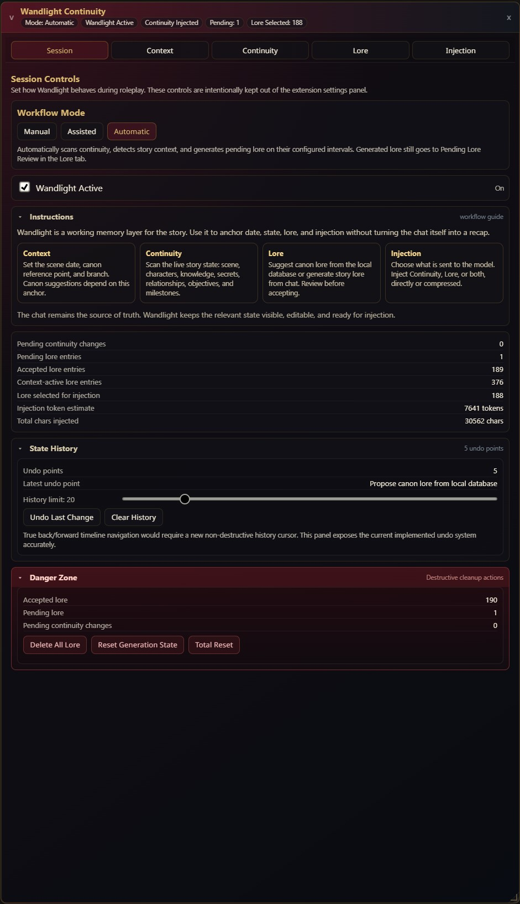
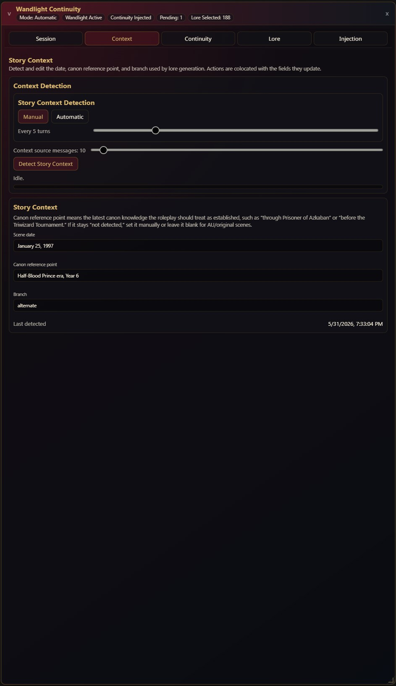
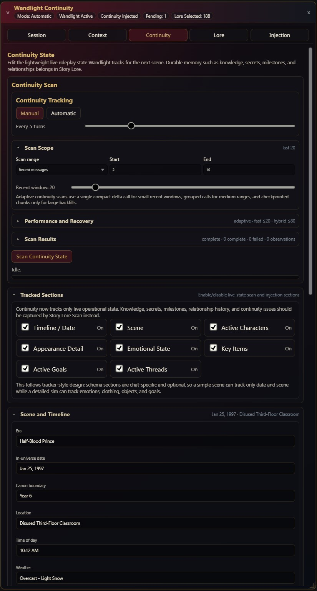
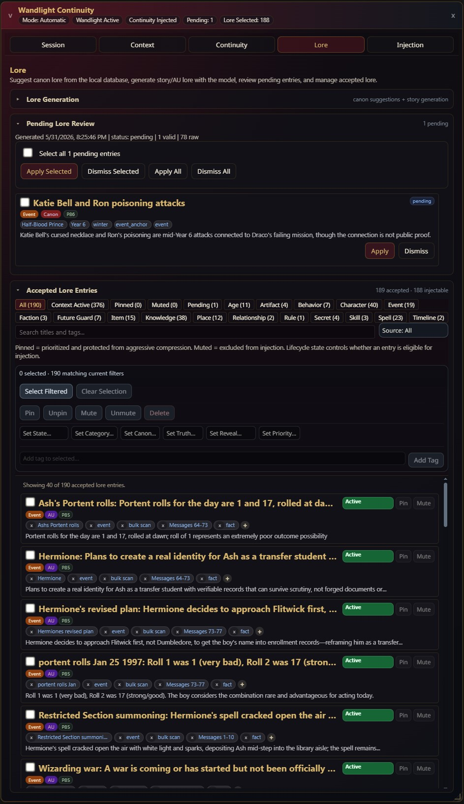
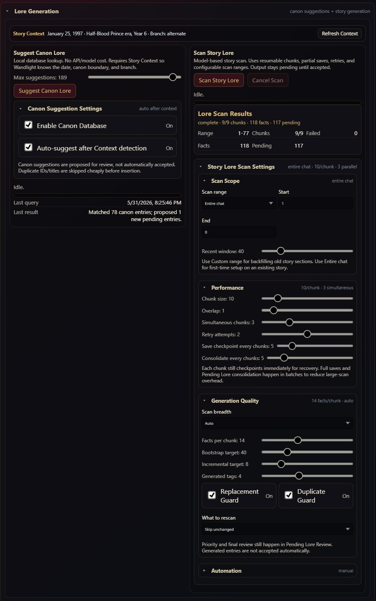
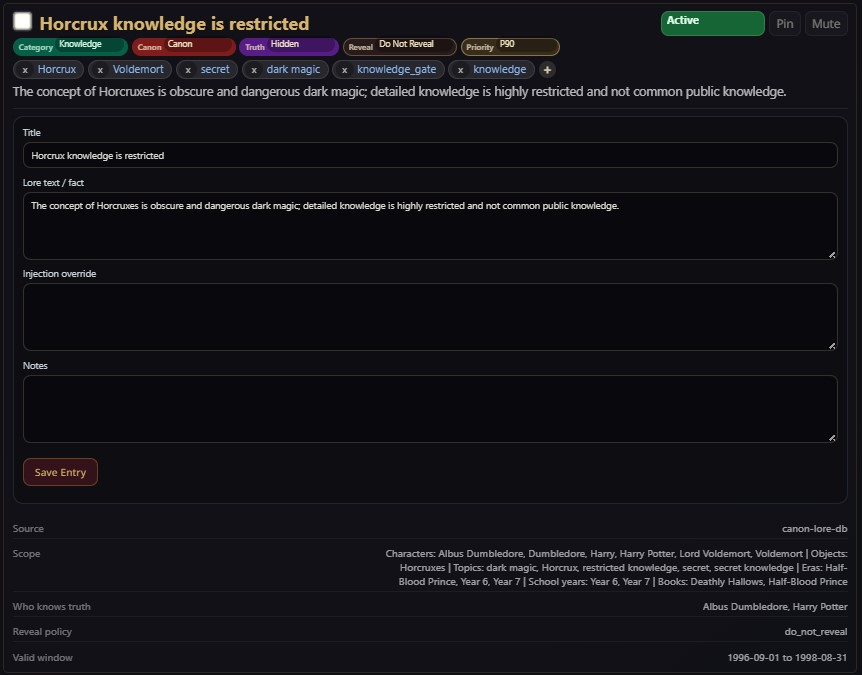
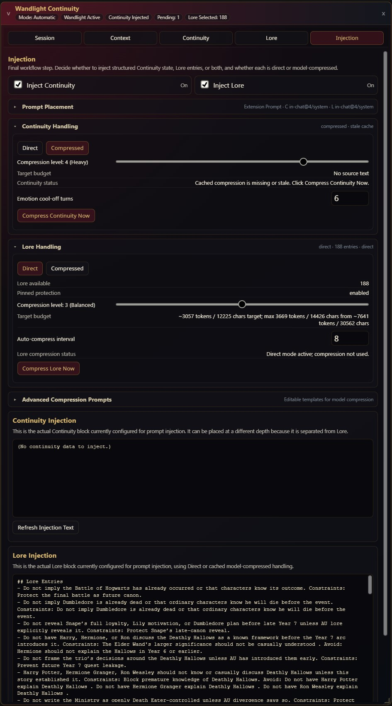

# Wandlight Continuity

Wandlight Continuity is a SillyTavern extension for long-form Harry Potter roleplay where chronology, canon timing, secrets, alternate timelines, and durable story memory matter.

It keeps the model anchored by separating four jobs that are often blended together in long chats: story context, live continuity, durable lore, and prompt injection. Wandlight does not replace your character card, writing preset, worldbook, or roleplay style. It gives the model a cleaner memory surface so the current scene can stay coherent without turning every prompt into a long recap.

## Who This Is For

Wandlight is intended for users who run roleplay sessions where continuity matters over many turns.

It is useful for:

- Harry Potter roleplay with canon-aware years, school terms, spoilers, and character knowledge boundaries.
- Alternate-universe stories where the chat has diverged from canon but still needs a known timeline anchor.
- Long chats where the model forgets dates, locations, active goals, carried items, relationships, secrets, or prior reveals.
- Users who want generated lore reviewed before it becomes active.
- Users who want explicit control over what continuity and lore are injected into the prompt.
- Users who are comfortable configuring model providers, scan ranges, and review workflows.

It may be excessive for short, casual, low-continuity chats.

## What Wandlight Does

Wandlight separates story memory into four layers.

| Layer | Purpose | Examples |
|---|---|---|
| Context | Determines where the story is in time and canon. | Scene date, school year, canon boundary, branch, time travel mode. |
| Continuity | Tracks live state needed for the current or next scene. | Current location, time of day, present characters, active goals, key items. |
| Lore | Stores durable story and canon facts as reviewable entries. | Secrets, relationships, milestones, canon gates, AU divergences, item history. |
| Injection | Controls what is actually sent back to the model. | Direct or compressed Continuity and Lore blocks, prompt role, position, depth. |

The distinction matters. Continuity is the short-term operational layer. Lore is the durable memory layer. If a fact should remain true across many scenes, it usually belongs in Lore. If a fact is mainly needed for the next few replies, it usually belongs in Continuity.

## Quick Mental Model

```text
Context tells Wandlight where the story is.
Continuity tells the model what is happening now.
Lore tells the model what remains true over time.
Injection controls how much of that reaches the prompt.
```

## Getting Started

### 1. Install

Install the extension folder here:

```text
data/default-user/extensions/third-party/WandlightContinuity
```

Then restart SillyTavern.

Keep the folder name as `WandlightContinuity` unless you also update the extension folder constant in the code. After restart, open SillyTavern's Extensions panel and find `Wandlight Continuity`.

### 2. Open the Runtime Window

The extension settings panel is mainly for setup, provider configuration, state import/export, and diagnostics.

The floating Runtime Window is where Wandlight is operated during roleplay. Open it from:

```text
Extensions panel -> Wandlight Continuity -> Runtime Window -> Open Wandlight Window
```

The Runtime Window contains the active workflow tabs:

- Session
- Context
- Continuity
- Lore
- Injection

### 3. Configure API and Model Settings

Open:

```text
Extensions panel -> Wandlight Continuity -> API and Model Settings
```

Wandlight uses two provider roles.

| Provider role | Used for | Recommended model traits |
|---|---|---|
| Utility Provider | Continuity scans and compression. | Fast, inexpensive, reliable at compact JSON or text transforms. |
| Reasoning Provider | Story context detection and story lore scanning. | Stronger reasoning, better long-context handling, better structured output. |

Provider choices:

| Choice | What it means |
|---|---|
| Current SillyTavern Model | Uses the model currently configured for chat generation. Simple, but it ties Wandlight work to your roleplay model. |
| Connection Profile | Uses a SillyTavern connection profile and optional completion preset. Useful when you maintain separate utility or reasoning profiles. |
| OpenAI-Compatible Endpoint | Uses a base URL, model ID, and stored API key. Useful for OpenAI-compatible local or hosted providers. |

For OpenAI-compatible endpoints:

1. Enter the Base URL.
2. Fetch models or type the exact model ID.
3. Enter the API key.
4. Click Store.
5. Leave JSON mode off unless the provider supports `response_format`.
6. Leave SillyTavern proxy off unless your proxy is configured.
7. Click Test Utility and Test Reasoning.

Generation parameters apply to reasoning calls:

| Setting | Default | Notes |
|---|---:|---|
| Temperature | 0.7 | Lower can improve structured output consistency. |
| Top P | 0.98 | Leave near default unless your provider needs adjustment. |
| Max Tokens | 8192 | Raised for large story lore scans and structured outputs. |

### 4. First Light Workflow

For a new chat or a lightly established story:

1. Open the Runtime Window.
2. Go to Context.
3. Click Detect Story Context.
4. Check the detected date, canon boundary, branch, and time travel mode.
5. Go to Continuity.
6. Click Scan Continuity State.
7. Review and edit the live scene state.
8. Go to Lore.
9. Click Suggest Canon Lore if Story Context is set.
10. Click Scan Story Lore if the chat already contains durable story facts.
11. Review Pending Lore Review and accept only entries you want active.
12. Go to Injection.
13. Enable or disable Continuity and Lore injection.
14. Use Direct mode first. Use Compressed mode only after you have confirmed the direct injection text is correct.

### 5. Recommended First-Time Setup for Existing Long Chats

For an existing long story with hundreds or thousands of messages:

1. Configure a capable Reasoning Provider.
2. Go to Context and run Detect Story Context.
3. Go to Lore.
4. Open Story Lore Scan Settings.
5. In Scan Scope, choose Entire chat or Custom range.
6. In Performance, keep Simultaneous chunks around 3 unless your provider can handle more.
7. In Generation Quality, use Auto or Bootstrap.
8. Click Scan Story Lore.
9. Let the scan produce Pending Lore entries in batches.
10. Review, accept, reject, mute, or edit entries before relying on them.
11. Go to Continuity and scan only the current/recent scene.

Do not use Continuity as a full-history memory system. Use Story Lore Scan for durable memory and Continuity for current operational state.

### 6. Safety and Review Model

Wandlight is designed around reviewable state.

- Context detection updates Story Context fields.
- Continuity scans update lightweight live state.
- Canon suggestions go to Pending Lore Review.
- Story Lore Scan outputs pending entries before they become active.
- Accepted Lore can still be edited, pinned, muted, expired, or deleted.
- Injection previews show what Wandlight intends to send before or while it is injected.

The chat remains the source of truth. Wandlight is a structured working memory layer.

<div style="page-break-after: always;"></div>

---

# Operator's Manual

This section documents the extension in operating order. It starts with the SillyTavern extension settings panel, then covers the Runtime Window tab by tab.

## Settings Panel

The settings panel lives inside SillyTavern's Extensions panel. It is not the main operating surface. Use it for initial setup, model routing, API keys, debugging, import/export, and raw state repair.

### Runtime Window Dropdown

The Runtime Window dropdown contains the handoff from setup to operation.

| Control | Purpose | Operating guidance |
|---|---|---|
| Open Wandlight Window | Opens the floating Runtime Window. | Use this during roleplay. Most day-to-day actions are in the Runtime Window, not the settings panel. |

The help text in this dropdown is intentionally direct: scanning, generation, review, editing, and injection toggles live in the runtime window.

### API and Model Settings Dropdown

This dropdown configures the model providers Wandlight uses for non-chat work.

#### Utility Provider

The Utility Provider is used for frequent or relatively small tasks.

Current responsibilities:

- Scan Continuity State.
- Automatic continuity tracking.
- Compress Continuity Now.
- Compress Lore Now.

Recommended model profile:

- Fast response time.
- Low cost per call.
- Reliable JSON for continuity scans.
- Good enough instruction following for compression.

This provider does not need to be your strongest creative roleplay model.

Controls:

| Control | Purpose |
|---|---|
| Provider selector | Chooses Current SillyTavern Model, Connection Profile, or OpenAI-Compatible Endpoint. |
| Connection Profile | Selects the SillyTavern profile used when provider mode is Connection Profile. |
| Completion Preset | Optional preset used with the selected connection profile. |
| Base URL | OpenAI-compatible endpoint base URL. |
| Model search / Model list | Lets you fetch or type the model ID. |
| Fetch Models | Retrieves available models from the endpoint. |
| API Key | Key used for this provider. |
| Store | Encrypts and stores the entered key locally. |
| Clear | Removes the stored key. |
| Use JSON mode | Advanced. Enable only when the provider supports OpenAI-style `response_format`. |
| Use SillyTavern proxy | Advanced. Enable only when your SillyTavern proxy is configured. |
| Test Utility | Sends a small test request through the Utility Provider. |

#### Reasoning Provider

The Reasoning Provider is used for less frequent, higher-value reasoning tasks.

Current responsibilities:

- Detect Story Context.
- Scan Story Lore.
- Generate Pending Lore entries through the lore scan system.

Recommended model profile:

- Stronger reasoning than the Utility Provider.
- Better long-context handling.
- Better JSON discipline.
- Good ability to extract durable facts without turning every detail into high-priority lore.

Controls are equivalent to the Utility Provider controls, but they apply to reasoning tasks.

| Control | Purpose |
|---|---|
| Provider selector | Chooses Current SillyTavern Model, Connection Profile, or OpenAI-Compatible Endpoint. |
| Connection Profile | Selects the profile used for reasoning tasks. |
| Completion Preset | Optional preset used with the selected reasoning profile. |
| Base URL | OpenAI-compatible endpoint base URL. |
| Model search / Model list | Lets you fetch or type the reasoning model ID. |
| Fetch Models | Retrieves available models from the reasoning endpoint. |
| API Key | Key used for this provider. |
| Store | Encrypts and stores the entered key locally. |
| Clear | Removes the stored key. |
| Use JSON mode | Advanced. Enable only if the provider supports `response_format`. |
| Use SillyTavern proxy | Advanced. Enable only if your proxy is configured. |
| Test Reasoning | Sends a small test request through the Reasoning Provider. |

#### Generation Parameters

These apply to reasoning calls.

| Setting | Purpose | Guidance |
|---|---|---|
| Temperature | Controls output randomness. | Use lower values if your model produces malformed JSON or inconsistent categories. |
| Top P | Controls nucleus sampling. | Leave at default unless your provider requires adjustment. |
| Max Tokens | Maximum response tokens for context and lore tasks. | Default is 8192. Lowering this may reduce latency but can truncate large lore outputs. |

### Data and Developer Debug Dropdown

This dropdown exposes raw data tools.

| Control | Purpose | Notes |
|---|---|---|
| Debug Mode | Enables verbose console logging. | Useful when diagnosing provider failures, scan issues, or state migration problems. |
| Current continuity state display | Shows raw Wandlight state. | Double-click the summary area to edit raw JSON. |
| Refresh | Reloads state from chat metadata. | Use if the display is stale. |
| Save State | Saves edited raw JSON. | Validate carefully before saving. Invalid state can break runtime behavior. |
| Undo Last Change | Restores the previous Wandlight state snapshot. | Snapshot depth is controlled by settings. |
| Import | Imports Wandlight state from a JSON file. | Use for backup restore or state transfer. |
| Export | Exports current Wandlight state to JSON. | Recommended before major refactors or manual edits. |
| Reset State | Resets Wandlight state to defaults. | A snapshot is taken first so the reset can be undone. |

Use raw JSON editing only when the Runtime Window controls are insufficient.

---

## Runtime Window

The Runtime Window is the active cockpit for Wandlight.

It is a floating, draggable, resizable panel with these tabs:

- Session
- Context
- Continuity
- Lore
- Injection

The window remembers open state, size, position, selected tab, and many collapsed subsection states per chat.

### Header and Status Bar

The header summarizes runtime state at a glance.

Common status pills include:

| Status | Meaning |
|---|---|
| Active or Paused | Whether Wandlight runtime behavior is enabled. |
| Context | Whether Story Context has usable date/canon information. |
| Continuity | Whether live continuity state has populated fields. |
| Lore | Accepted and pending lore status. |
| Injection | Whether Continuity and/or Lore are currently configured for injection. |

The header also contains panel controls for collapsing, dragging, resizing, and closing the window.

---

## Session Tab



The Session tab is the runtime overview and safety panel. It controls workflow mode, shows counts, provides brief instructions, and exposes undo/reset actions.

### Session Controls

The top section is `Session Controls`.

#### Workflow Mode

Workflow Mode is a behavior preset.

| Mode | Behavior | Recommended use |
|---|---|---|
| Manual | No automatic extraction or lore generation. | Best for setup, debugging, and careful control. |
| Assisted | Automatically scans continuity after turns. Context and lore stay manual. | Best default for active roleplay once configured. |
| Automatic | Automatically scans continuity, detects story context, and scans story lore on configured intervals. | Use only after you trust your provider and review workflow. |

Changing Workflow Mode updates several underlying automation settings.

#### Wandlight Active

This is the master runtime switch.

When off, Wandlight pauses runtime behavior such as automatic extraction, generation, and prompt injection. Stored state remains available.

### Instructions

The Instructions collapsible gives a short in-window workflow reference.

Use it as an operational reminder:

1. Set Context.
2. Scan Continuity.
3. Suggest or scan Lore.
4. Review Pending Lore.
5. Configure Injection.

### Runtime Statistics

The Session tab shows state and injection counts.

| Field | Meaning |
|---|---|
| Pending continuity changes | Legacy pending continuity delta count. Current scans generally apply directly to editable continuity sections. |
| Pending lore entries | Generated or suggested lore entries waiting for review. |
| Accepted lore entries | Entries stored in the accepted lore matrix. |
| Context-active lore entries | Accepted entries active for the current context. |
| Lore selected for injection | Entries currently eligible after context, pin, mute, lifecycle, and fallback rules. |
| Injection token estimate | Approximate combined token estimate for current Continuity and Lore injection. |
| Total chars injected | Combined character count for current injection previews. |

### State History

State History stores undo snapshots.

Use this when:

- A scan produced bad state.
- You accepted the wrong batch of lore.
- You edited raw JSON incorrectly.
- You want to revert a recent Wandlight operation.

### Danger Zone

Danger Zone contains destructive actions such as reset or cleanup functions. Export state before using destructive controls.

---

## Context Tab



The Context tab determines the story's date, canon boundary, branch, and time travel mode. Context is used by canon lore suggestion and by lore generation prompts.

### Context Detection

Context Detection uses the Reasoning Provider.

Controls:

| Control | Purpose |
|---|---|
| Manual / Automatic | Chooses whether context detection runs only on click or automatically every configured number of turns. |
| Every N turns | Automatic interval for context detection. |
| Context source messages | Number of recent messages sent to the detector. This is separate from Story Lore Scan source messages. |
| Detect Story Context | Runs detection and updates Story Context fields below. |
| Status / progress bar | Shows current or last context detection status. |

Context Detection does not create lore entries. It updates context fields.

### Story Context Editor

Editable Story Context fields:

| Field | Meaning |
|---|---|
| Scene date | In-universe date if known. Exact dates are best, but approximate text is allowed. |
| Subjective date | Character-perceived date when time travel or timeline displacement is relevant. |
| Canon boundary | Latest canon point treated as established. Examples: before the Triwizard Tournament, after Chamber of Secrets. |
| Branch | Timeline branch identifier. Default is usually `main`; AU stories can use a custom branch. |
| Time travel mode | Whether the story is normal, altered, or contains subjective/objective date separation. |

Operational guidance:

- If canon suggestions are empty, check Story Context first.
- If date detection is uncertain, manually set the scene date or canon boundary.
- If the story is AU, use Branch to distinguish custom continuity from main canon.
- If time travel is involved, separate `sceneDate` from `subjectiveDate`.

---

## Continuity Tab



The Continuity tab tracks lightweight live state. It is not a long-term story memory database. Durable memory belongs in Lore.

Current Continuity sections:

| Section | Purpose |
|---|---|
| Scene and Timeline | Current date, boundary, location, time, weather, ambience, present characters, nearby characters, current activity. |
| Active Characters | Live character state relevant to the current scene. |
| Key Items | Consequential currently relevant items. |
| Active Goals | Current objectives, blockers, stakes, and statuses. |
| Active Threads | Immediate unresolved threads affecting the next scene. |

Removed from first-class Continuity tracking:

- Knowledge
- Secrets
- Relationship history
- Story milestones
- Canon divergences
- Continuity Issues / Flags

Those belong in Story Lore Scan and accepted Lore entries when they are durable.

### Scan Continuity State

The top Continuity action scans chat messages and updates the live continuity state.

The scanner is adaptive.

| Strategy | When used | Model-call shape |
|---|---|---|
| Fast | Small recent scans, default <= 20 messages. | One compact direct delta call. |
| Hybrid | Medium scans, default <= 80 messages. | Grouped section calls. |
| Bulk / checkpointed | Large scans and backfills. | Chunked observations, checkpoints, reducers, final delta. |

Most routine roleplay should use Recent messages and Adaptive strategy. Large scans are for repair or backfill, not every turn.

### Scan Scope

Controls which messages the scanner reads.

| Control | Purpose | Guidance |
|---|---|---|
| Scan range | Recent messages, Custom range, or Entire chat. | Use Recent for normal play. Use Custom/Entire for repairs. |
| Start | First 1-based message index for Custom range. | Only used in Custom range mode. |
| End | Last 1-based message index for Custom range. | Use 0 for latest message. |
| Recent window | Number of recent messages scanned in Recent mode. | Default is 10. Increase only if the current scene context is spread out. |

### Performance and Recovery

These controls tune adaptive scanning.

| Control | Purpose | Guidance |
|---|---|---|
| Scan strategy | Adaptive, Always fast, Always hybrid, or Always bulk/checkpointed. | Use Adaptive unless testing. |
| Fast threshold | Message count at or below which Adaptive uses the fast path. | Default 20. |
| Hybrid threshold | Message count at or below which Adaptive uses hybrid path. | Default 80. Larger ranges use bulk. |
| Fast max tokens | Max output tokens for fast scan. | Default 2048. |
| Hybrid max tokens | Max output tokens per hybrid call. | Default 3072. |
| Chunk size | Messages per observation chunk in bulk mode. | Larger chunks reduce calls but can be harder to parse. |
| Overlap | Messages repeated between chunks. | Helps facts that cross boundaries. |
| Simultaneous chunks | Parallel bulk extraction calls. | Default 3. Increase only if your provider handles concurrency. |
| Simultaneous reducers | Parallel reducer calls after observations. | Default 3. |
| Retry attempts | Retry count after empty, malformed, or failed responses. | Default 2. |
| Observations per chunk | Upper target for observations extracted from each chunk. | Higher can increase coverage but also output size. |
| Observation max tokens | Max output tokens for observation extraction. | Used only in bulk path. |
| Reducer max tokens | Max output tokens for reducers. | Used only in bulk path. |
| Save checkpoint every chunks | Full checkpoint interval in bulk mode. | Per-chunk lightweight checkpoints still happen. |
| What to rescan | Skip unchanged, retry failed, rescan edited, or rescan all. | Use Skip unchanged for normal repeated scans. |

### Continuity Scan Results

Shows the latest scan batch.

Typical fields:

| Field | Meaning |
|---|---|
| Status | Completed, failed, partial, skipped, or running status. |
| Strategy | Fast, hybrid, or bulk. |
| Model calls | Expected model calls, excluding repair retries. |
| Completed chunks | Bulk chunk completion count. |
| Failed chunks | Failed chunk count. |
| Observations | Number of observations extracted in bulk mode. |

For fast scans, chunk counts may be low or absent because the scanner bypasses the bulk pipeline.

### Tracked Sections

Tracked Sections control which lightweight sections Wandlight scans and injects.

Current labels include:

- Timeline / Date
- Scene
- Active Characters
- Appearance Detail
- Emotional State
- Key Items
- Active Goals
- Active Threads

Use fewer tracked sections for smaller or weaker Utility Provider models.

### Scene and Timeline

Scene and Timeline contains editable fields:

| Field | Meaning |
|---|---|
| Era | Broad era or period. |
| In-universe date | Current story date. |
| Canon boundary | Latest canon point considered established. |
| Location | Current location. |
| Time of day | Current time of day. |
| Weather | Weather if relevant. |
| Ambience | Mood or environmental tone. |
| Current activity | What is happening now. |
| Present characters | Characters currently in the active scene. |
| Nearby characters | Characters nearby but not necessarily speaking. |

This section also has an editable Scan Prompt. The prompt is appended when the section is tracked.

### Active Characters

Active Characters is JSON-based.

Recommended object shape:

```json
{
  "name": "Harry",
  "role": "student",
  "currentLocation": "Great Hall",
  "clothing": "school robes",
  "posture": "standing near the table",
  "physicalState": "tired",
  "emotionalState": {
    "trust": 2,
    "fear": 1,
    "notes": "uneasy but cooperative"
  },
  "carriedItems": ["wand"],
  "goals": ["find the source of the curse"],
  "notes": "Only immediate scene-relevant notes."
}
```

Do not put long relationship history, secrets, or milestones here. Put those in Lore.

### Key Items

Key Items is JSON-based and should stay selective.

Use it for currently relevant consequential objects:

```json
[
  {
    "name": "silver knife",
    "owner": "Hermione",
    "location": "inside her satchel",
    "status": "hidden",
    "notes": "Relevant to the current scene."
  }
]
```

Item history belongs in Lore.

### Active Goals and Threads

Active Goals and Active Threads are grouped together because both represent near-term direction.

Use Active Goals for current objectives:

```json
[
  {
    "goal": "reach the library before curfew",
    "owner": "Harry",
    "status": "active",
    "blockers": ["Filch is patrolling the corridor"],
    "stakes": "being caught would expose the plan"
  }
]
```

Use Active Threads for immediate unresolved threads:

```json
[
  {
    "thread": "source of the whispering in the walls",
    "status": "active",
    "nextStep": "ask Moaning Myrtle what she heard"
  }
]
```

Long-term plot memory belongs in Lore.

---

## Lore Tab



The Lore tab is the durable memory system. It manages local canon suggestions, model-scanned story lore, Pending Lore Review, and accepted lore entries.

### Lore Generation



The Lore Generation section has two main workflows.

#### Story Context Status

At the top of the Lore Generation card, Wandlight shows the current Story Context.

If context is missing, use Refresh Context or return to the Context tab and click Detect Story Context.

#### Suggest Canon Lore

Suggest Canon Lore uses the local `Lore/` database. It does not call a model.

| Control | Purpose |
|---|---|
| Max suggestions | Maximum local canon entries to propose into Pending Lore Review. |
| Suggest Canon Lore | Queries the local database using Story Context. |
| Canon Suggestion Settings | Enables/disables the database and auto-suggest after context detection. |
| Last query | Last time the canon database was queried. |
| Last result | Summary of the previous query. |

Canon suggestions are proposed, not accepted automatically.

Priority matters. High-priority entries are more likely to be selected when Max suggestions is limited. Routine date anchors are usually lower priority than spoiler guards, irreversible events, or major canon constraints.

#### Scan Story Lore

Scan Story Lore uses the Reasoning Provider to create durable story/AU lore entries.

It is the correct place for:

- character knowledge
- secrets
- reveals
- relationships
- milestones
- long-term threads
- item ownership and history
- canon divergences
- faction ties
- durable character state
- world changes

Controls:

| Control | Purpose |
|---|---|
| Scan Story Lore | Runs the configured story-lore scan. |
| Cancel Scan | Requests cancellation of the active scan. |
| Status / progress bar | Shows scan progress and status. |
| Lore Scan Results | Shows the latest scan ledger summary. |
| Story Lore Scan Settings | Advanced scan controls. |

##### Scan Scope

| Control | Purpose | Guidance |
|---|---|---|
| Scan range | Recent messages, Custom range, or Entire chat. | Use Recent for upkeep. Use Entire for first-time backfill on existing chats. |
| Start | First 1-based message index for Custom range. | Only used in Custom range. |
| End | Last 1-based message index for Custom range. | Use 0 for latest. |
| Recent window | Number of recent messages scanned in Recent mode. | Default 40. |

##### Performance

| Control | Purpose | Guidance |
|---|---|---|
| Chunk size | Messages per lore scan chunk. | Smaller chunks are safer; larger chunks reduce calls. |
| Overlap | Messages repeated at chunk boundaries. | Helps facts that span chunks. |
| Simultaneous chunks | Number of parallel Reasoning Provider calls. | Default 3. Increase only if stable. |
| Retry attempts | Per-chunk retry attempts. | Default 2. |
| Save checkpoint every chunks | Full checkpoint interval. | Lightweight per-chunk checkpoints still happen immediately. |
| Consolidate every chunks | How many chunks are collected before conversion into Pending Lore entries. | Higher values reduce duplicate pending entries but delay visible results. |

##### Generation Quality

| Control | Purpose | Guidance |
|---|---|---|
| Scan breadth | Auto, Bootstrap, or Incremental. | Auto uses Bootstrap for sparse first-run story lore and Incremental later. |
| Facts per chunk | Target compact facts extracted before consolidation. | Higher values increase coverage and output size. |
| Bootstrap target | Approximate target pending entries for first-run scans. | Default 40. |
| Incremental target | Approximate target for maintenance scans. | Default 8. |
| Generated tags | Number of tags requested per entry. | Tags improve search and filtering. |
| Replacement Guard | Warns before replacing unresolved pending lore batches. | Keep enabled unless intentionally replacing. |
| Duplicate Guard | Filters likely duplicate entries. | Disable temporarily if too much story lore is being dropped. |
| What to rescan | Skip unchanged, retry failed, rescan edited, or rescan all. | Use Skip unchanged for repeated scans. |

##### Automation

| Control | Purpose |
|---|---|
| Manual / Automatic | Chooses whether Story Lore Scan runs only on click or every configured number of turns. |
| Every N turns | Automatic scan interval. |

Automatic story lore still goes to Pending Lore Review.

### Lore Scan Results

Lore Scan Results is the user-facing view of the scan ledger.

It exists so large scans can be durable and resumable.

The scan system uses:

- message ranges
- chunks
- overlaps
- per-chunk hashes
- retries
- immediate lightweight checkpoints
- periodic full checkpoints
- candidate facts
- consolidation batches
- pending-entry provenance

If a large scan fails halfway through, completed chunks are not discarded. Rescan modes can skip unchanged chunks, retry failures, or rescan edited intervals.

### Pending Lore Review

Pending Lore Review is where generated and suggested entries wait before becoming accepted lore.

Use this section to:

- accept one entry
- reject one entry
- bulk accept selected entries
- bulk reject selected entries
- inspect generated metadata
- edit entries before acceptance

Pending entries use the same card style as accepted lore. This keeps metadata, lifecycle, priority, and category controls visually consistent.

### Lore Entry Anatomy



A lore entry can include:

| Field | Purpose |
|---|---|
| Title | Human-readable entry name. |
| Fact | The durable fact. |
| Injection | The wording used when the entry is injected. |
| Category | UI grouping such as character, event, item, knowledge, spell, relationship, or timeline. |
| Kind | Functional type such as knowledge gate, future guard, spell gate, behavior gate, or timeline anchor. |
| Canon status | Whether the entry is canon, AU, divergent, uncertain, etc. |
| Truth status | Whether it is true, hidden, rumor, lie, or otherwise qualified. |
| Reveal policy | Whether and how the model may reveal it. |
| Priority | Relative selection and compression importance. |
| Lifecycle | Whether the entry is active, future, blocked, expired, muted, canon overdue, etc. |
| Scope | Characters, locations, objects, spells, topics, books, years, or factions it applies to. |
| Tags | Search labels and lightweight classification. |

Important controls:

| Control | Meaning |
|---|---|
| Pinned | Prioritizes and protects the entry during compression. |
| Muted | Stores the entry but excludes it from injection. |
| Lifecycle badge | Controls whether the entry is injectable now. |
| Metadata chips | Editable category, canon status, truth status, reveal policy, and priority. |

### Accepted Lore Entries

Accepted Lore Entries is the main durable memory matrix.

Controls include:

| Control | Purpose |
|---|---|
| Category tabs | Filter by active, pinned, muted, expired, blocked, future, canon, AU, secret, relationship, location, rule, timeline, character, event, item, knowledge, place, faction, spell, artifact, and other categories. |
| Search | Searches title and tags first, then fact text, notes, and IDs. |
| Source filter | Filters Canon Database, Story Generation, or Manual/User entries. |
| Bulk toolbar | Applies bulk lifecycle, category, priority, pin, mute, accept, reject, or delete actions depending on selection. |
| Show more | Renders more accepted entries while keeping the browser responsive. |

Accepted Lore Entries has its own scroll region so the list can remain usable inside the resized Wandlight window.

---

## Injection Tab



The Injection tab is the final workflow step. It controls what Wandlight sends to the roleplay model.

### Injection Toggles

| Toggle | Purpose |
|---|---|
| Inject Continuity | Sends the lightweight live Continuity state. |
| Inject Lore | Sends accepted active Lore entries. |

Turning a toggle off does not delete state. It only stops that layer from being injected.

### Prompt Placement

Prompt Placement controls how Wandlight inserts Continuity and Lore into SillyTavern prompts.

Recommended default:

```text
Injection method: Extension Prompt
Role: System
Position: In-chat
Depth: 4
```

Controls:

| Control | Options | Meaning |
|---|---|---|
| Injection method | Extension Prompt, Legacy prepend | Extension Prompt uses SillyTavern's prompt injection API. Legacy prepend adds a combined block to the last user message. |
| Position | In-chat, After prompt, Before prompt | Where the block is inserted. |
| Depth | Number | For In-chat placement, 0 is closest to the latest message. Higher values move the block earlier. |
| Role | System, User, Assistant | Role assigned to the injected block. |
| Sync Injection Now | Forces an immediate prompt sync. |

Continuity and Lore have separate placement settings.

### Continuity Handling

Continuity Handling controls whether Continuity is injected directly or through a compressed cache.

| Mode | Meaning |
|---|---|
| Direct | Sends structured Continuity state with full detail. |
| Compressed | Sends a cached model-compressed version if current; otherwise falls back to direct until compressed. |

Controls:

| Control | Purpose |
|---|---|
| Compression level | 1 to 5, from light to aggressive. |
| Target budget | Shows target tokens and characters for the current source text. |
| Continuity status | Shows whether the compression cache is current, stale, missing, or failed. |
| Emotion cool-off turns | Affects injection preview decay for temporary high emotions. Does not overwrite stored state. |
| Compress Continuity Now | Uses the Utility Provider to create or refresh the compressed cache. |

### Lore Handling

Lore Handling controls accepted lore injection.

| Mode | Meaning |
|---|---|
| Direct | Sends accepted, unmuted, eligible lore entries as resolved text. |
| Compressed | Sends a cached model-compressed version if current; otherwise falls back to direct until compressed. |

Controls:

| Control | Purpose |
|---|---|
| Lore available | Count of accepted, unmuted entries eligible for injection. |
| Pinned protection | Indicates that pinned entries are protected in compression prompts. |
| Compression level | 1 to 5, from light to aggressive. |
| Target budget | Shows target tokens and characters for the current source text. |
| Auto-compress interval | Number of turns before lore compression should refresh after changes. |
| Lore compression status | Shows whether cache is current, stale, missing, or failed. |
| Compress Lore Now | Uses the Utility Provider to create or refresh the compressed cache. |

### Advanced Compression Prompts

Compression prompts are editable templates.

Variables include:

| Variable | Meaning |
|---|---|
| `{{kind}}` | Continuity or Lore. |
| `{{compressionLevel}}` | Numeric level 1 to 5. |
| `{{compressionLabel}}` | Human label for the level. |
| `{{directTokens}}` | Estimated source tokens. |
| `{{targetTokens}}` | Target output tokens. |
| `{{hardTokenLimit}}` | Hard maximum token budget. |
| `{{directCharacters}}` | Source character count. |
| `{{targetCharacters}}` | Target character count. |
| `{{hardCharacterLimit}}` | Hard maximum character budget. |
| `{{storyContext}}` | Current Story Context summary. |
| `{{directText}}` | Direct injection text being compressed. |

Rules for editing:

- Keep the instruction to output only compressed injection text.
- Do not ask the model to explain its changes.
- Preserve pinned/protected lore more fully.
- Keep dynamic length variables unless you intentionally want static behavior.

### Injection Previews

The bottom of the Injection tab shows separate previews:

| Preview | Meaning |
|---|---|
| Continuity Injection | Actual Continuity block that will be injected if enabled. |
| Lore Injection | Actual Lore block that will be injected if enabled. |

Use previews to verify state before relying on prompt injection.

---

## Lore Database

The local canon database lives in `Lore/`.

It includes chronology, characters, ages, spell gates, behavior gates, knowledge gates, artifacts, locations, school-year skill bands, future guards, expanded book coverage, and calendar-derived timeline anchors.

Important files:

| File | Purpose |
|---|---|
| `Lore/manifest.json` | Lists lore database files to load. |
| `Lore/index.json` | Index metadata for bundled lore files. |
| `Lore/taxonomy.json` | UI labels, colors, and registry values. |
| `Lore/gate-types.json` | Gate type definitions. |
| `Lore/scoring.json` | Ranking weights for canon suggestions. |
| `Lore/user/custom_entries.json` | Safe place for user-authored entries. |
| `Lore/README.md` | Detailed lore schema and authoring guide. |

The database is not intended to be a full wiki. It is a constraint and timing layer for roleplay.

### Adding User Lore

Recommended path:

1. Open `Lore/user/custom_entries.json`.
2. Add entries under the `entries` array.
3. Keep valid JSON.
4. Add stable IDs.
5. Include title, kind, category, priority, date/scope, fact, and injection text.
6. Restart or reload the extension.

For larger custom databases, add a new file under `Lore/user/` and reference it in `Lore/manifest.json`.

---

## Prompt Injection Model

Wandlight builds prompt text from two independent sources.

| Source | Builder | Typical contents |
|---|---|---|
| Continuity Injection | Continuity preview builder | Scene/timeline, active characters, key items, active goals/threads. |
| Lore Injection | Lore preview builder | Accepted active lore entries, including canon constraints and story memory. |

These can be injected separately and compressed separately.

Direct mode is more transparent. Compressed mode is useful when direct text becomes too large.

Compression is cached. Changing the underlying direct text, level, prompt template, or relevant lore state can make the cache stale.

---

## Automation Model

Automation is intentionally split.

| Automation | Location | Provider | Output |
|---|---|---|---|
| Continuity tracking | Continuity tab / Session workflow mode | Utility Provider | Updates live Continuity state. |
| Story Context detection | Context tab | Reasoning Provider | Updates Story Context fields. |
| Story Lore Scan | Lore tab | Reasoning Provider | Adds Pending Lore entries. |
| Canon suggestion | Lore tab / Context flow | No model | Adds Pending Lore entries from local database. |
| Compression refresh | Injection tab | Utility Provider | Updates cached compressed injection text. |

Use Manual mode during setup. Use Assisted when you trust Continuity scanning. Use Automatic only after the pending-lore review loop is comfortable.

---

## Performance and Model Selection

### Recommended Provider Split

| Task | Suggested provider |
|---|---|
| Continuity fast scans | Utility Provider |
| Continuity compression | Utility Provider |
| Lore compression | Utility Provider |
| Detect Story Context | Reasoning Provider |
| Story Lore Scan | Reasoning Provider |

### Continuity Performance

For normal play:

- Scan range: Recent messages.
- Recent window: 10 to 20 messages.
- Scan strategy: Adaptive.
- Use fewer tracked sections if the Utility Provider struggles.

For large repairs:

- Use Custom range or Entire chat.
- Keep Simultaneous chunks modest.
- Use Skip unchanged for repeated scans.

### Lore Performance

For first-time long-chat setup:

- Use Entire chat or Custom range.
- Use Bootstrap or Auto breadth.
- Keep chunk size around 10.
- Keep concurrency around 3 unless provider capacity is known.
- Review Pending Lore in batches.

For ongoing maintenance:

- Use Recent messages.
- Use Auto or Incremental breadth.
- Keep Duplicate Guard enabled.

### Compression Performance

Compression is model-based and can take time. Use it after direct previews are correct.

Compression level guidance:

| Level | Use case |
|---|---|
| 1 | Light cleanup, preserve most wording. |
| 2 | Balanced default. |
| 3 | Meaningful reduction with compact bullets. |
| 4 | Aggressive reduction. |
| 5 | Maximum compression; use when token pressure is severe. |

---

## Slash Commands

Wandlight registers several slash commands when SillyTavern's slash command API is available.

| Command | Purpose |
|---|---|
| `/wandlight-extract` | Manually run continuity state extraction. |
| `/wandlight-memo` | Copy the continuity memo to clipboard. |
| `/wandlight-state` | Export full Wandlight state JSON to clipboard. |
| `/wandlight-lore-detect` | Run Story Context detection. |
| `/wandlight-lore-scan` | Run Story Lore Scan. |
| `/wandlight-lore-generate` | Compatibility alias for `/wandlight-lore-scan`. |
| `/wandlight-lore-accept` | Accept all pending lore entries. |
| `/wandlight-lore-reject` | Reject all pending lore entries. |
| `/wandlight-lore-panel` | Toggle the floating Runtime Window. |

---

## Troubleshooting

### The extension does not load

Check:

- The folder is installed at `data/default-user/extensions/third-party/WandlightContinuity`.
- The folder contains `manifest.json`, `index.js`, `settings.html`, and `style.css` at the top level.
- Browser console has no JavaScript module parse errors.
- The zip was extracted as a folder, not nested as `WandlightContinuity/WandlightContinuity/...`.

### API tests fail

Check:

- Provider mode is correct.
- Base URL is correct.
- API key is stored.
- Model ID is valid.
- JSON mode is disabled unless supported.
- SillyTavern proxy is disabled unless configured.
- The selected model can return short structured responses.

### Context detection is wrong

Try:

- Increase Context source messages.
- Manually edit Scene date and Canon boundary.
- Use a stronger Reasoning Provider.
- Set Branch for AU timelines.
- Use subjective date for time travel situations.

### Continuity scans are slow

Try:

- Use Recent messages, not Entire chat.
- Keep Recent window around 10 to 20.
- Use Adaptive strategy.
- Use a faster Utility Provider.
- Disable unnecessary tracked sections.
- Avoid bulk/checkpointed scans for routine play.

### Continuity sections stay blank

This can be correct if the source messages do not establish that section.

Try:

- Increase Recent window slightly.
- Check tracked section toggles.
- Edit the section manually.
- Adjust that section's Scan Prompt.
- Put durable facts in Story Lore Scan instead of Continuity.

### Story Lore Scan returns too few entries

Try:

- Use Bootstrap breadth.
- Increase scan range.
- Increase Facts per chunk.
- Increase Bootstrap target.
- Disable Duplicate Guard temporarily if story facts are being filtered too aggressively.
- Use a stronger Reasoning Provider.
- Increase Max Tokens.

### A large Story Lore Scan fails halfway through

Use Lore Scan Results and rescan modes.

Recommended recovery:

1. Set What to rescan to Retry failed only.
2. Run Scan Story Lore again.
3. If past messages were edited, use Rescan edited only.
4. If the ledger seems stale or unwanted, use Rescan all.

Completed chunks are designed to survive failures.

### Injection text is too large

Try:

- Mute low-value lore entries.
- Pin only critical lore.
- Use Compressed mode.
- Increase compression level.
- Review direct preview before compressing.
- Move temporary details out of Lore if they are no longer relevant.

### Compressed mode appears stale

Try:

- Click Compress Continuity Now or Compress Lore Now.
- Check whether direct source text changed.
- Check whether compression level or prompt template changed.
- Return to Direct mode to inspect source text.

---

## Advanced File Layout

Top-level files:

| File | Purpose |
|---|---|
| `manifest.json` | SillyTavern extension manifest. |
| `index.js` | Extension initialization, slash commands, settings mount, global hooks. |
| `settings.html` | SillyTavern extension settings UI. |
| `style.css` | Runtime window and settings styles. |
| `constants.js` | Defaults, schema version, prompt templates, settings. |
| `state-manager.js` | State loading, saving, migration, snapshots, lore acceptance. |
| `lore-panel.js` | Floating Runtime Window UI. |
| `continuity-scanner.js` | Adaptive continuity scan engine. |
| `extractor.js` | Continuity extraction trigger integration. |
| `lore-generator.js` | Context detection and story lore scan orchestration. |
| `lore-llm-client.js` | Provider abstraction for model calls. |
| `lore-matrix.js` | Lore normalization, lifecycle, filtering, injection eligibility. |
| `canon-lore-db.js` | Local canon database loading and suggestion logic. |
| `memo-builder.js` | Continuity and lore injection preview construction. |
| `prompt-injector.js` | SillyTavern prompt injection integration. |
| `secure-keyring.js` | Local encrypted API key storage. |
| `ui.js` | Settings panel wiring and provider controls. |
| `Presets/Wandlight.json` | Optional preset data. |
| `Images/` | README screenshots and banner. |
| `Lore/` | Local canon and user lore database. |

---

## Glossary

| Term | Meaning |
|---|---|
| Accepted Lore | Lore entries that have been approved and stored in the lore matrix. |
| Active Lore | Accepted lore that is eligible for the current context. |
| Branch | Timeline identifier, such as main or a custom AU branch. |
| Canon boundary | Latest canon point treated as established. |
| Checkpoint | Durable scan progress save used for recovery. |
| Continuity | Short-lived active scene state. |
| Context | Current date, canon reference point, branch, and time travel mode. |
| Direct injection | Full injection text without model compression. |
| Lifecycle | Entry state such as active, future, blocked, expired, muted, or canon overdue. |
| Muted | Stored but excluded from injection. |
| Pending Lore | Generated or suggested lore waiting for review. |
| Pinned | Prioritized and protected during compression. |
| Reasoning Provider | Provider role for context detection and story lore scanning. |
| Utility Provider | Provider role for continuity scanning and compression. |

---

## License

See `LICENSE`.
